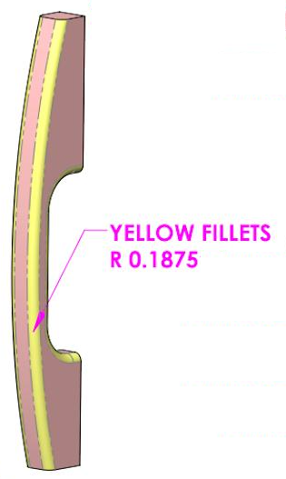
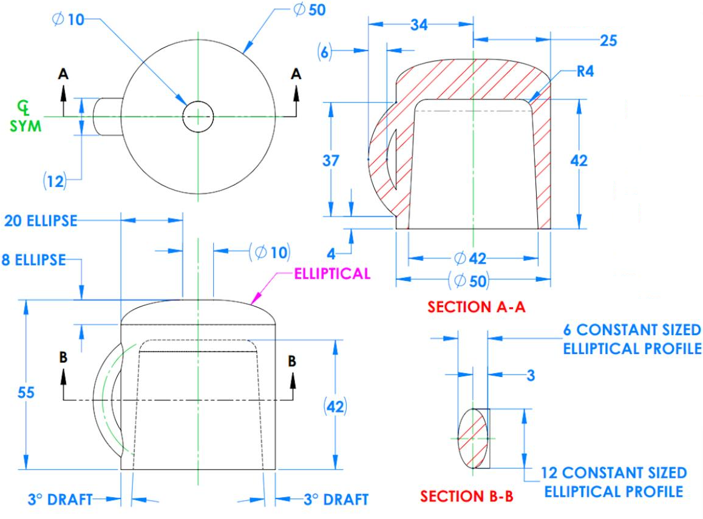
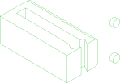

# /pub/examples/competition/tootalltobby

Too Tall Tobby competition models.

This package contains a subset of practice models from the Too Tall Tobby competition.
The models are provided in the form of images, and PartCAD AI features are used
to reconstruct the 3D models from the images.
The models are not yet ejected from the initial AI configuration, so you
can use your own AI API keys to tweak the input data as well as the prompts to
regenerate the scripts.
You can also easily change the PartCAD configuration
to generate OpenSCAD or build123d scripts instead of CadQuery ones.

For the best experience, open this repository in a Visual Studio Code workspace with the
[PartCAD vscode extension](https://marketplace.visualstudio.com/items?itemName=OpenVMP.partcad)
installed.

## Parts

### tier01-24-01-01
<table><tr>
<td valign=top></td>
<td valign=top>The attached images depict a single solid object.

The first image is a technical drawing showing the object's
projections onto the three coordinate planes (XY, XZ, and YZ).
INSERT_IMAGE_HERE(input-24-01-01-blueprint.png)

The other two images are rendered views of the object from different perspectives:
INSERT_IMAGE_HERE(input-24-01-01-render1.png)
INSERT_IMAGE_HERE(input-24-01-01-render2.png)
</td>
<td valign=top>Input images:
 
 
 
</td>
</tr></table>

### tier01-24-04-02
<table><tr>
<td valign=top></td>
<td valign=top>The attached images depict a single solid object.

The first image is a technical drawing showing the object's
projections onto the three coordinate planes (XY, XZ, and YZ):
INSERT_IMAGE_HERE(input-24-04-02-blueprint.png)

The remaining two images are rendered views of the object from different perspectives:
INSERT_IMAGE_HERE(input-24-04-02-render1.png)
INSERT_IMAGE_HERE(input-24-04-02-render2.png)
</td>
<td valign=top>Input images:
 
 
 
</td>
</tr></table>

### tier01-24-04-04
<table><tr>
<td valign=top></td>
<td valign=top>The attached images depict a single solid object.

The first image is a technical drawing showing the object's
projections onto the three coordinate planes (XY, XZ, and YZ):
INSERT_IMAGE_HERE(input-24-04-04-blueprint.png)

The remaining two images are rendered views of the object from different perspectives:
INSERT_IMAGE_HERE(input-24-04-04-render1.png)
INSERT_IMAGE_HERE(input-24-04-04-render2.png)
</td>
<td valign=top>Input images:
 
 
 
</td>
</tr></table>

### tier03-24-01-03
<table><tr>
<td valign=top></td>
<td valign=top>The attached images depict a single solid object.

The first image is a technical drawing showing the object's
projections onto the three coordinate planes (XY, XZ, and YZ):
INSERT_IMAGE_HERE(input-24-01-03-blueprint.png)

The remaining two images are rendered views of the object from different perspectives:
INSERT_IMAGE_HERE(input-24-01-03-render1.png)
INSERT_IMAGE_HERE(input-24-01-03-render2.png)
</td>
<td valign=top>Input images:
 
 
 
</td>
</tr></table>

### tier03-24-01-04
<table><tr>
<td valign=top></td>
<td valign=top>The attached images depict a single solid object.

The first image is a technical drawing showing the object's
projections onto the three coordinate planes (XY, XZ, and YZ):
INSERT_IMAGE_HERE(input-24-01-04-blueprint.png)

The second image is a rendered view of the object from a perspective:
INSERT_IMAGE_HERE(input-24-01-04-render1.png)
</td>
<td valign=top>Input images:
 
 
</td>
</tr></table>

### tier04-24-01-02
<table><tr>
<td valign=top></td>
<td valign=top>The attached images depict a single solid object.
The first image is a technical drawing showing the object's
projections onto the three coordinate planes (XY, XZ, and YZ):
INSERT_IMAGE_HERE(input-24-01-02-blueprint.png)

The remaining two images are rendered views of the object from different perspectives:
INSERT_IMAGE_HERE(input-24-01-02-render1.png)
INSERT_IMAGE_HERE(input-24-01-02-render2.png)
</td>
<td valign=top>Input images:
 
 
 
</td>
</tr></table>

  

*Generated by [PartCAD](https://partcad.org/)*
